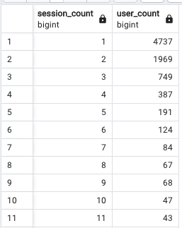
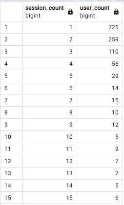
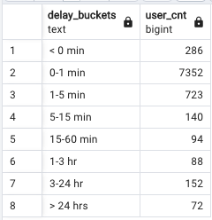

 

Codebase
WIP

Architecture Diagram 
WIP

EDA

Before I can make reports for different teams, I have to understand the data I'm working with. My process here is going through each table to ensure I understand what every field means and then specifically looking for integrity issues, which impacts any type of downstream reporting. For example, Any nulls? Any non-deduped ids? etc. Here is how I walked through this: 

I first looked at the `summary reports ad networks` table. At first, the table looks good. No nulls, strong naming conventions, but then....

It appears like the MMP is recording installs, but the ad network isn't reporting any cost, impression or click data for those installs. This could be for a few reasons, like the ad network didn't send a postback or the ad network itself wasn't properly connected to the MMP.  

A natural next question is where might these installs be coming from according to the MMP, so I'll turn my attention to `mmp_singular_install_events`. First, I checked if `session_id` and `player_id` had any duplicates, which they didn't. I then was interested in the count of installs by network: 

So ~ 15% of installs are unattributed, which is bad. It means that these installs were not mapped to any ad network, but at the same time are not marked as organic, which is indicative of spend that is not being tracked. Best guesses as to why are tracking link issues or postbacks between the ad network and mmp have failed. Therefore, we could join installs with the ad networks to see where installs are coming from (or not coming from). 

We can also more user-based questions like from the `start_session_events` table as well, namely are the unattributed installers having sessions? If not, it could be indicative of fraud. First, I verified that session id's are unique and their were no nulls in the table, so we have integrity from that perspective. Second, I was curious about session behavior across all users, which should follow a power law curve, which it does: 

Then I was curious of what session behavior would be like from the unattributed users. We should also expect it to follow a power curve and it does: 

This means its far more likely that we just have misattribution, as in these are real users whose install source was lost due to tracking issues.

Semi-related, something else worth looking into is the difference between a users first session and their posted install date (with the assumption that a users' first session fires first and then an install event is sent to the MMP.), which I got as : 

In other words, ~ 85% of installs are recorded within 1 minute, but there is a long tail of installs where the install is recorded well after the first session. This is worthy of looking into. 

Now I wanted to look at revenue. This might just be definition based, but there seems to some sort of an inconsistency between `actual_revenue` and `revenue_d1 + revenue_d7`. My initial thought was that actuals = d1 + d7...but that's not the case. It's possible actuals incorporate revenue beyond what is presented here. It's also possible that `revenue_d1` and `revenue_d7` represent cumulative monetization at those specific points in time. If that is true and we are not missing revenue data then `acutal_revenue` should equal `revenue_d7`. 

However, I found that in 7 out of 31 cases where actualized revenue did not match what is seemingly cumulative monetization at day 7. 

