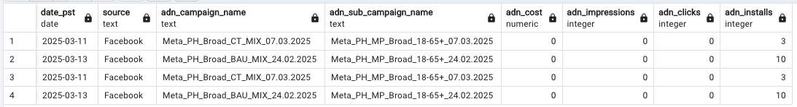
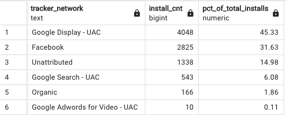

 

Codebase
WIP

Architecture Diagram 
WIP

EDA

Before I can make reports for different teams, I have to understand the data I'm working with. My process here is going through each table to ensure I understand what every field means and then looking for integrity issues. For example, Any nulls? Any non-deduped ids? etc. Here is how I walked through this: 

I first looked at the `summary reports ad networks` table. At first, the table looks good. No nulls, strong naming conventions, but then....

It appears like the MMP is recording installs, but the ad network isn't reporting any cost, impression or click data for those installs. This could be for a few reasons, like the ad network didn't send a postback or the ad network itself wasn't properly connected to the MMP. 

A natural next question is where might these installs be coming from according to the MMP, so I'll turn my attention to `mmp_singular_install_events`. First, I checked if `session_id` and `player_id` had any duplicates, which they didn't. I then was interested in the count of installs by network: 

So ~ 15% of installs are unattributed, which is bad. It means that these installs were not mapped to any ad network, but at the same time are not marked as organic, which is indicative of spend that is not being tracked. Best guesses as to why are tracking ling issue or postbacks between the ad network and mmp failed.

